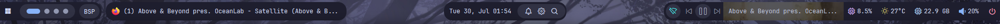
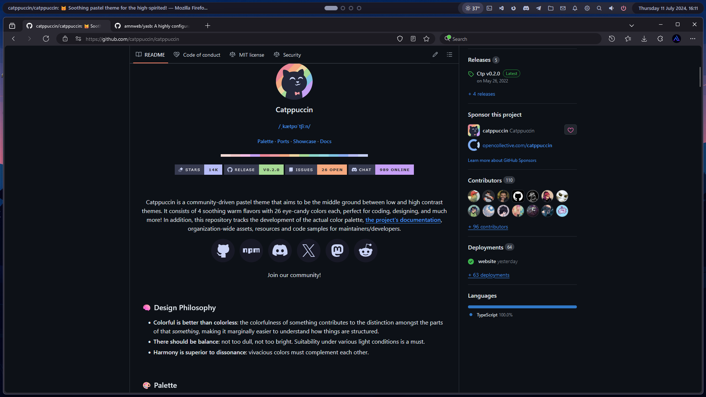
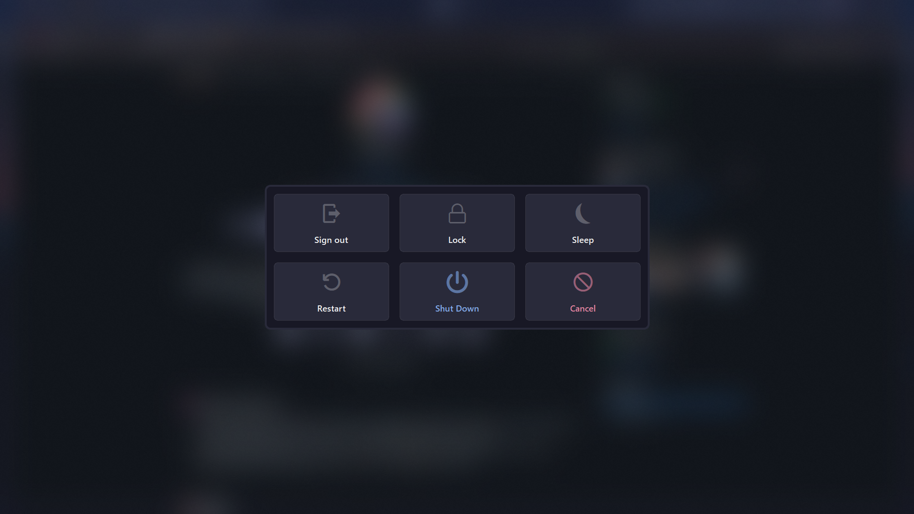

<p align="center"></p>
<h1 align="center">YASB Reborn</h1>
<p align="center">
  A highly configurable Windows status bar written in Python.
  <br><br>
  <a href="https://opensource.org/licenses/MIT"></a>
  <a href="https://github.com/amnweb/yasb"></a>
  <a href="https://github.com/amnweb/yasb/issues"></a>
  <a href="https://github.com/amnweb/yasb/releases"></a>
  <a href="https://github.com/amnweb/yasb/releases/latest"></a>
  <a href="https://discord.gg/qkeunvBFgX" title="Discord"></a>
</p>

***

<h3 align="center">
<a href="https://github.com/amnweb/yasb/wiki">Wiki</a>・<a href="https://github.com/amnweb/yasb-themes">Share Your Theme</a>・<a href="https://github.com/amnweb/yasb/discussions">Discussions</a>・<a href="https://github.com/amnweb/yasb/issues">Report a bug</a>
</h3>

***

# Installation

### Requirements
- Nerd Fonts. Install [Nerd Fonts](https://www.nerdfonts.com/font-downloads) ([JetBrainsMono](https://github.com/ryanoasis/nerd-fonts/releases/latest/download/JetBrainsMono.zip) recommended)
- Windows 10 & 11

### Installer
- Download the latest installer from the [GitHub releases page](https://github.com/amnweb/yasb/releases/latest).
- Run the installer and follow the on-screen instructions to complete the installation.

***

### Winget
Install the YASB using Winget install
```powershell
winget install --id AmN.yasb
```

***

### Scoop
Install YASB using Scoop:
```powershell
scoop bucket add extras
scoop install extras/yasb
```

***

### Chocolatey
Install YASB using Chocolatey:
```powershell
choco install yasb
```

***

### Using Python
- Install Python 3.12
- Install the application and its dependencies:
  - `pip install .` (for regular installation)
  - `pip install -e .[dev]` (for development installation)
- Start the application:
  - run `python src/main.py` in your terminal (or click [yasb.vbs](src/yasb.vbs))
  - Configure [styles.css](src/styles.css) and [config.yaml](src/config.yaml) to your liking.


## Demo YASB



for more themes visit [yasb-themes](https://github.com/amnweb/yasb-themes)
## Demo YASB + Komorebi



https://github.com/user-attachments/assets/aab8d8e8-248f-46a1-919c-9b0601236ac1


> [!NOTE]  
> This repository is updated on a regular basis; when you update files, always check [styles.css](src/styles.css) and [config.yaml](src/config.yaml) for new features and changes; otherwise, your config can be broken.


## List of currently available widgets in YASB.

- **[Active Windows Title](https://github.com/amnweb/yasb/wiki/(Widget)-Active-Windows-Title)**: Displays the title of the currently active window.
- **[Applications](https://github.com/amnweb/yasb/wiki/(Widget)-Applications)**: Shows a list of predefined applications.
- **[Battery](https://github.com/amnweb/yasb/wiki/(Widget)-Battery)**: Displays the current battery status.
- **[Bluetooth](https://github.com/amnweb/yasb/wiki/(Widget)-Bluetooth)**: Shows the current Bluetooth status and connected devices.
- **[Brightness](https://github.com/amnweb/yasb/wiki/(Widget)-Brightness)**: Displays and change the current brightness level.
- **[Cava](https://github.com/amnweb/yasb/wiki/(Widget)-Cava)**: Displays audio visualizer using Cava.
- **[CPU](https://github.com/amnweb/yasb/wiki/(Widget)-CPU)**: Shows the current CPU usage.
- **[Clock](https://github.com/amnweb/yasb/wiki/(Widget)-Clock)**: Displays the current time and date.
- **[Custom](https://github.com/amnweb/yasb/wiki/(Widget)-Custom)**: Create a custom widget.
- **[Github](https://github.com/amnweb/yasb/wiki/(Widget)-Github)**: Shows notifications from GitHub.
- **[GlazeWM Binding Mode](https://github.com/amnweb/yasb/wiki/(Widget)-GlazeWM-Binding-Mode)**: GlazeWM binding mode widget.
- **[GlazeWM Tiling Direction](https://github.com/amnweb/yasb/wiki/(Widget)-GlazeWM-Tiling-Direction)**: GlazeWM tiling direction widget.
- **[GlazeWM Workspaces](https://github.com/amnweb/yasb/wiki/(Widget)-GlazeWM-Workspaces)**: GlazeWM workspaces widget.
- **[Grouper](https://github.com/amnweb/yasb/wiki/(Widget)-Grouper)**: Groups multiple widgets together in a container.
- **[Home](https://github.com/amnweb/yasb/wiki/(Widget)-Home)**: A customizable home widget menu.
- **[Disk](https://github.com/amnweb/yasb/wiki/(Widget)-Disk)**: Displays disk usage information.
- **[Language](https://github.com/amnweb/yasb/wiki/(Widget)-Language)**: Shows the current input language.
- **[Launchpad](https://github.com/amnweb/yasb/wiki/(Widget)-Launchpad)**: A customizable launchpad for quick access to applications.
- **[Libre Hardware Monitor](https://github.com/amnweb/yasb/wiki/(Widget)-Libre-HW-Monitor)**: Connects to Libre Hardware Monitor to get sensor data.
- **[Media](https://github.com/amnweb/yasb/wiki/(Widget)-Media)**: Displays media controls and information.
- **[Memory](https://github.com/amnweb/yasb/wiki/(Widget)-Memory)**: Shows current memory usage.
- **[Microphone](https://github.com/amnweb/yasb/wiki/(Widget)-Microphone)**: Displays the current microphone status.
- **[Notifications](https://github.com/amnweb/yasb/wiki/(Widget)-Notifications)**: Shows the number of notifications from Windows.
- **[Notes](https://github.com/amnweb/yasb/wiki/(Widget)-Notes)**: A simple notes widget that allows you to add, delete, and view notes.
- **[OBS](https://github.com/amnweb/yasb/wiki/(Widget)-Obs)**: Integrates with OBS Studio to show recording status.
- **[Power Plan](https://github.com/amnweb/yasb/wiki/(Widget)-Power-Plan)**: Displays the current power plan and allows switching between plans.
- **[Server Monitor](https://github.com/amnweb/yasb/wiki/(Widget)-Server-Monitor)**: Monitors server status.
- **[Systray](https://github.com/amnweb/yasb/wiki/(Widget)-Systray)**: Displays system tray icons.
- **[Traffic](https://github.com/amnweb/yasb/wiki/(Widget)-Traffic)**: Displays network traffic information.
- **[Todo](https://github.com/amnweb/yasb/wiki/(Widget)-Todo)**: Organizes your tasks and to-do lists.
- **[Taskbar](https://github.com/amnweb/yasb/wiki/(Widget)-Taskbar)**: A customizable taskbar for launching applications.
- **[Pomodoro](https://github.com/amnweb/yasb/wiki/(Widget)-Pomodoro)**: A Pomodoro timer widget.
- **[Power Menu](https://github.com/amnweb/yasb/wiki/(Widget)-Power-Menu)**: A menu for power options.
- **[Recycle Bin](https://github.com/amnweb/yasb/wiki/(Widget)-Recycle-Bin)**: Shows the status of the recycle bin. 
- **[Update Checker](https://github.com/amnweb/yasb/wiki/(Widget)-Update-Check)**: Checks for available updates using Windows Update and Winget.
- **[Visual Studio Code](https://github.com/amnweb/yasb/wiki/(Widget)-VSCode)**: Shows recently opened folders in Visual Studio Code.
- **[Volume](https://github.com/amnweb/yasb/wiki/(Widget)-Volume)**: Shows and controls the system volume.
- **[Wallpapers](https://github.com/amnweb/yasb/wiki/(Widget)-Wallpapers)**: Allows changing wallpapers.
- **[Weather](https://github.com/amnweb/yasb/wiki/(Widget)-Weather)**: Displays current weather information.
- **[WiFi](https://github.com/amnweb/yasb/wiki/(Widget)-WiFi)**: Shows the current WiFi status.
- **[WHKD](https://github.com/amnweb/yasb/wiki/(Widget)-Whkd)**: Shows the current hotkey.
- **[Windows-Desktops](https://github.com/amnweb/yasb/wiki/(Widget)-Windows-Desktops)**: Windows desktops switcher.
- **[Komorebi Control](https://github.com/amnweb/yasb/wiki/(Widget)-Komorebi-Control)**: Komorebi control widget.
- **[Komorebi Layout](https://github.com/amnweb/yasb/wiki/(Widget)-Komorebi-Layout)**: Shows the current layout of Komorebi.
- **[Komorebi Stack](https://github.com/amnweb/yasb/wiki/(Widget)-Komorebi-Stack)**: Shows windows in the current Komorebi stack.
- **[Komorebi Workspaces](https://github.com/amnweb/yasb/wiki/(Widget)-Komorebi-Workspaces)**: Komorebi workspaces widget.


## 🏆 Contributors
Thanks to our amazing contributors!

[](https://github.com/amnweb/yasb/graphs/contributors)
