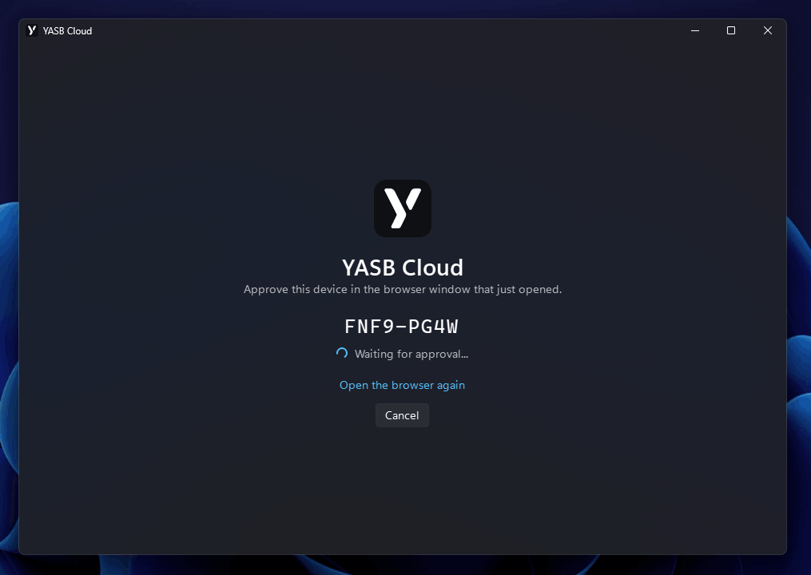
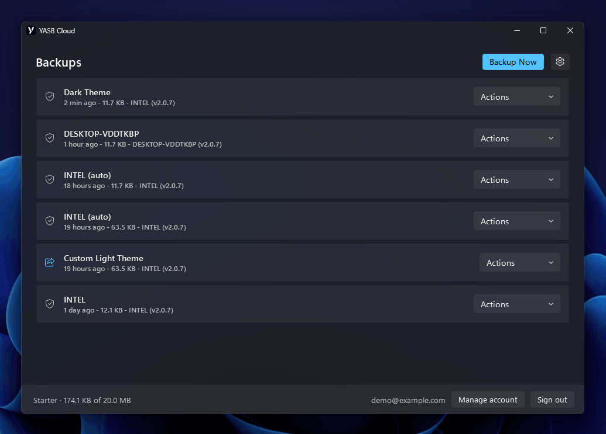
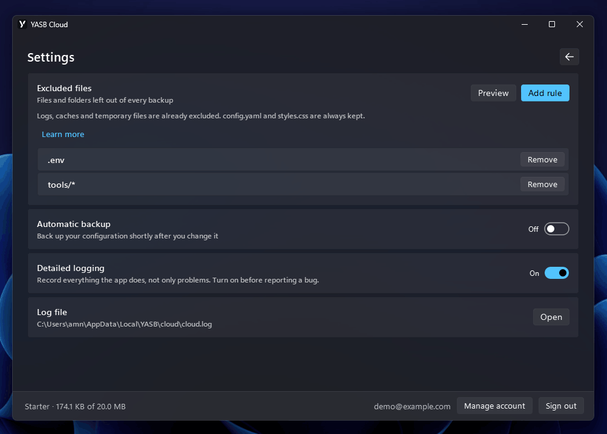

# YASB Cloud
YASB Cloud keeps a copy of your YASB configuration online so you can put it back later. It is useful when you break something and want yesterday's setup, when you reinstall Windows, or when you keep the same bar on a desktop and a laptop.

Your configuration is packed up and encrypted on your PC before anything is uploaded.

YASB Cloud comes with YASB. There is nothing extra to install. You can use it from the app window or from the command line, and both do the same things.

## What you need
An account and an active subscription. You can create both at [cloud.yasb.dev](https://cloud.yasb.dev).

If your subscription ends you can still open the app, sign in and restore your existing backups for 14 days, you just cannot make new ones. At the end of those 14 days the stored backups are deleted. We email you before that happens, and subscribing again at any point before the deadline brings everything back.

## Signing in
Open YASB Cloud and click **Sign in**. Your browser opens and the app shows a short code.

Check that the code in your browser matches the one in the app before you approve. If they do not match, someone else is trying to sign in and you should close the page.

Once you approve, the app signs itself in and stays signed in. You will not be asked again unless you sign out.



## The backups list
After signing in you see your backups, newest first. Each row shows the note you gave it, then the date, the size, which PC it came from and which YASB version made it.

Every row starts with a small icon. A shield means that backup is private. A highlighted share icon means it has a public link.

At the bottom you see the account you are signed in as, your plan, and how much of your storage is used.



## Backing up
Click **Backup Now**. You can type a note so you recognise it later, for example "before I tried the new theme". If you leave it empty, the name of your PC is used.

The app packs your configuration folder, encrypts it, and uploads it. Log files, caches and temporary files are left out automatically.

## Automatic backup
Turn on **Automatic backup** in settings and YASB Cloud backs itself up shortly after you change something. It waits until you have stopped editing, so a session of tweaking produces one backup instead of twenty.

### How the check works
Nothing runs in the background while you are not using it. Turning the switch on creates a Windows scheduled task called **YASB Cloud Automatic Backup**, which runs every five minutes. Each run is a separate short-lived process: it looks at your configuration folder, decides whether to do anything, and exits. Most runs never touch the network.

To decide, it lists every file a backup would include and notes each one's size and modification time. It does not read file contents, so the check stays fast even on a large configuration. That list is compared against the previous run.

A backup happens only when the folder looks **identical on two runs in a row** and that exact state has not already been uploaded. So a change is noticed on one run and uploaded on the next, which means a backup lands somewhere between five and ten minutes after your last edit. Keep editing and the clock keeps resetting, which is why a long session produces one backup at the end rather than one every five minutes.

Automatic backups are named after your PC with `(auto)` after it, so you can tell them apart from the ones you made yourself.

### When it does not back up
Backing up manually, or restoring a backup, both count as up to date. The next check sees nothing new and stays quiet rather than immediately uploading the same thing again.

If your PC is off, asleep, or you are signed out, the check simply does not run or does nothing. A missed run is picked up the next time the machine is available. Being signed out does not remove the task, so signing back in resumes automatic backup on its own.

If an upload fails, or you are offline, nothing is recorded as backed up and the next quiet check tries again. There is no retry storm and no error to dismiss, it just catches up.

Battery is not a blocker. Windows normally skips scheduled tasks on battery power, which would mean automatic backup silently never running on a laptop, so the task is created with that behaviour switched off.

### Subscription
Automatic backup needs an active subscription. If your subscription ends, the next check turns the setting off, removes the scheduled task, and shows a notification with a link to your account, rather than retrying forever.

This only happens on a clear answer from the server. Being offline or catching the service during maintenance leaves the setting alone.

## Restoring a backup
Pick a backup, open **Actions** and choose **Restore**.

This replaces your configuration folder with the one from the backup. Anything you added since that backup is removed, so you end up with exactly the setup you saved rather than a mixture of the two.

Before it touches anything, YASB Cloud saves a copy of your current configuration on your PC. If the restore fails halfway, your old setup is put back automatically. The last five of these copies are kept.

YASB stops during the restore and starts again afterwards. If it does not come back, start it with `yasbc start`.

## Saving a copy without restoring
If you want to look at a backup without replacing anything, choose **Save a copy** and pick a folder. The files are written into a new folder named after the date of the backup, so nothing already in that folder is overwritten.

This is the safe way to take one file out of an old backup.

## Sharing a backup
**Share publicly** creates a link that anyone can use to download that backup.

Be careful with this. The backup is your configuration exactly as it was, so if any of your files contain an API key, a token or a password, whoever opens the link gets those too. Share a backup you made for the purpose, not your everyday one.

Once shared, the row gets **Copy link** and **Stop sharing**. Stopping makes the link dead immediately.

## Excluded files
Some things do not belong in a backup. Logs, caches and temporary files are already left out, and so are folders like `.git`, `.venv` and `node_modules`.

You can add your own rules under **Excluded files** in settings.

- A rule without a slash matches a file name anywhere in your configuration folder. `*.env` leaves out every `.env` file, wherever it is.
- A rule with a slash matches the path instead. `secrets/*` leaves out everything in the `secrets` folder.

Rules are not case sensitive, so `*.ENV` and `*.env` do the same thing.

`config.yaml` and `styles.css` are always included and no rule can remove them. YASB cannot start without them, and a backup missing them looks fine until the day you need it.

Click **Preview** to see how many files your rules would leave out before you rely on them.



## Other settings
**Detailed logging** writes much more to the log file. Leave it off unless you are chasing a problem or someone has asked you for a log.

**Log file** shows where the log lives and opens the folder for you.

## Command line
Everything in the app is also available as `yasbc cloud`.

```bash
yasbc cloud --help
```

### Commands
- `auth` - Sign in through your browser.
- `logout` - Sign out on this machine.
- `status` - Show the signed-in account, plan and usage.
- `list` - List your backups.
- `backup` - Back up the configuration directory now.
- `restore` - Replace the configuration with a backup.
- `save` - Save a backup to a folder without restoring it.
- `delete` - Delete a backup from YASB Cloud.
- `share` - Publish a backup and print its link.
- `unshare` - Stop sharing a backup.

### Naming a backup
Commands that act on a backup take either `latest` or an id from `yasbc cloud list`.

```bash
yasbc cloud list
```

```bash
yasbc cloud restore latest
```

You do not need to type the whole id. The short one shown by `list` is enough.

### Examples
Sign in, then check what you have:

```bash
yasbc cloud auth
```

```bash
yasbc cloud status
```

Back up with a note:

```bash
yasbc cloud backup --note "before switching to the dark theme"
```

Find an old backup and put it back. `-y` skips the confirmation, so leave it off the first time:

```bash
yasbc cloud list --search laptop
```

```bash
yasbc cloud restore a1b2c3d4e5f6
```

Take a copy without touching your current setup:

```bash
yasbc cloud save latest C:\Users\me\Desktop
```

Share one, then stop sharing it:

```bash
yasbc cloud share a1b2c3d4e5f6
```

```bash
yasbc cloud unshare a1b2c3d4e5f6
```

Long backup lists are shown fifty at a time:

```bash
yasbc cloud list --page 2
```

Press Ctrl-C to cancel. Nothing is left half finished: a cancelled backup is thrown away, and a cancelled restore puts your old configuration back. A restore interrupted in its very last moment may still finish, so glance at your bar before assuming nothing happened.

## Where your files are
Everything YASB Cloud keeps on your PC is in `%LOCALAPPDATA%\YASB\cloud`.

That includes your sign-in, your settings, the log files, and the safety copies made before a restore. Your actual configuration stays where it always was, in `.config\yasb`.

## Common questions
**Do I need to leave anything running?** No. There is no background service. Automatic backup is a scheduled check that runs and exits.

**Will a backup include my secrets?** If they are in your configuration folder, yes. Use an exclude rule to keep them out, and check it with **Preview** before you trust it.

**What happens if my PC dies mid-restore?** Your previous configuration is saved first and put back automatically. If even that fails, the app tells you where the copy is.

**Can I use the same account on two PCs?** Yes. Sign in on both. Each backup records which PC it came from, so you can tell them apart.

**What happens to my backups if I stop paying?** They stay for 14 days and you can restore any of them in that time. After 14 days they are deleted. You get an email before the deadline, and subscribing again before it restores everything.

**Can I move to a smaller plan?** Only if what you are storing fits it. Nothing is ever deleted to make a plan fit, so if you are over the smaller plan's limits, delete some backups first and then switch.

**I signed out but I am still listed as a device.** Signing out ends the session properly. If you had no connection at the time, the app tells you so, and you can remove the device from your account page.

**Where do I report a problem?** Turn on **Detailed logging**, reproduce the problem, then open the log folder from settings and attach `cloud.log`.
