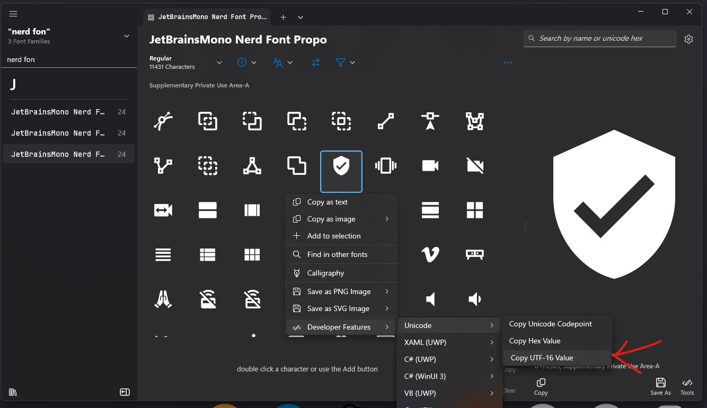

## Style file    

Styling is done using the CSS file format and with a file named `styles.css`.

Default directories for this file are `C:/Users/{username}/.config/yasb/` or the ENV variable `YASB_CONFIG_HOME` if set. A good starting point is the [default style](https://github.com/amnweb/yasb/blob/main/src/styles.css).

## Bar styling

The main YASB window can be styled with the following:
- `.yasb-bar`

## Widget Group Styling

Each widget group can be styled individually with the following:
- `.container-left`
- `.container-center`
- `.container-right`

## Generic Widget Style

A style with the `.widget` selector would affect all the widgets. In practice, you may prefer to use more specific `.*-widget` selectors.
Example: how to target the clock widget
```
.clock-widget {
	border-top-left-radius: 18px;
	border-bottom-left-radius: 18px;
}
```

## Per-output styling

The main YASB windows carry a class tag with the name of the output this window is shown on.

```
* { font-size: 13px;color: #cdd6f4; }
```

Example above will set the default font size and color of all elements unless overridden later on.


## Style Icons

Icons can be styled with the following:
- `.icon`

.icon class above will affect all icons inside the span tag in configuration file.
`label: "<span>\uf4bc</span> {virtual_mem_free}"`
You can specify different icon class in the configuration file as shown below.

```
label: "<span class=\"icon-1"\">\uf4bc</span> {virtual_mem_free}"
```

> **Note**:
> To avoid some icons being cut off on the sides, it's recommended to use the proportional version of your Nerd Font (e.g. `JetBrainsMono Nerd Font Propo`),


## Style Text

Text can be styled with the following:
- `.label`

## Widget Container Styling

Each icon and text is wrapped in a container. This container can be styled with the following:
- `.widget-container`

Example how to target widget container

``` 
.clock-widget .widget-container {
    background-color: #1e1e1e;
    border-radius: 10px;
}
.media-widget .widget-container {
    background-color: #1e1e1e;
    border-radius: 10px;
}
```

> **Note:**
> Keep in mind that YASB is written in Python and styled with very limited CSS. You can't use CSS3 or any other advanced CSS features.


## Follow OS Theme
YASB can follow the OS theme, if you have OS dark style YASB will add class `.dark` on the root element, if you want to have different light and dark themes you can use the following CSS to achieve this.

```css
.yasb-bar {
    /* background color for light style */
    background-color: #1e1e1e;
}
.yasb-bar.dark {
    /* background color for dark style */
    background-color: #1e1e1e;
}
.yasb-bar .label {
    /* text color for light style */
    color: #000000;
}
.yasb-bar.dark .label {
    /* text color for dark style */
    color: #ffffff;
}
.icon {
    color: #cdd6f4;
}

```

## Context Menu Styling
Context menus can be styled using the `.context-menu` class. This allows you to customize the appearance of menus within YASB. 
> **Note**:
> If you want to have different menu styles for each widget please refer to the Widget documentation for more information on how to achieve this.

Example of context menu styling:
```css
/* Global context menu style */
.context-menu,
.context-menu .menu-checkbox {
    background-color: #202020;
    border: none;
    padding: 4px 0px;
    font-family: 'Segoe UI';
    font-size: 12px;
    color: #FFFFFF;
}
.context-menu::right-arrow {
    width: 8px;
    height: 8px;
    padding-right: 24px;
}
.context-menu::item,
.context-menu .menu-checkbox {
    background-color: transparent;
    padding: 6px 12px;
    margin: 2px 6px;
    border-radius: 6px;
    min-width: 100px;
}
.context-menu::item:selected,
.context-menu .menu-checkbox:hover {
    background-color: #3a3a3a;
    color: #FFFFFF;
}
.context-menu::separator {
    height: 1px;
    background-color: #404040;
    margin: 4px 8px;
}
.context-menu::item:disabled {
    color: #666666;
    background-color: transparent;
}
.context-menu .menu-checkbox .checkbox {
    border: none;
    padding: 8px 16px;
    font-size: 12px;
    margin: 0;
    color: #FFFFFF;
    font-family: 'Segoe UI'
}
.context-menu .submenu::item:disabled {
    margin: 0;
    padding-left: 16px;
}
.context-menu .menu-checkbox .checkbox:unchecked {
    color: #999
}
.context-menu .menu-checkbox .checkbox::indicator {
    width: 12px;
    height: 12px;
    margin-left: 0px;
    margin-right: 8px;
}
.context-menu .menu-checkbox .checkbox::indicator:unchecked {
    background: #444444;
    border-radius: 2px;
}
.context-menu .menu-checkbox .checkbox::indicator:checked {
    background: #007acc;
    border-radius: 2px;
}
.context-menu .menu-checkbox .checkbox:focus {
    outline: none;
}
.context-menu::item:checked {
    background-color: #0078d7;
    color: white;
}
```

## Tooltip Styling
Tooltips can be styled using the `.tooltip` class. This allows you to customize the appearance of tooltips within YASB.

Example of tooltip styling:
```css
.tooltip {
    background-color: #18191a;
    border: 1px solid #36383a;
    border-radius: 4px;
    color: #a6adc8;
    padding: 6px 12px;
    font-size: 13px;
    font-family: 'Segoe UI';
    font-weight: 600;
    margin-top: 4px;
}
```
## Shadow Options

Most widgets support `label_shadow` and `container_shadow`, but you should check the widget documentation to confirm support before configuring shadows.

### How to Configure Shadows

Add the following to your per-widget configuration (YAML):

```yaml
label_shadow:
  enabled: true
  offset: [0, 2]        # [x, y] offset in pixels
  radius: 3             # Blur radius
  color: "#000000"    # Hex color (with optional alpha) or color name
container_shadow:
  enabled: true
  offset: [0, 2]
  radius: 3
  color: "#00000080"
```

- `enabled`: Set to `true` to enable the shadow.
- `offset`: List or tuple of two numbers for the shadow's x and y offset.
- `radius`: Blur radius for the shadow.
- `color`: Color of the shadow. Supports hex (with or without alpha) or named colors (e.g., "black").

> **Note**:
> If the container is transparent, the shadow will be applied to the child container and buttons instead. This can cause double shadows if you also apply shadows to those child elements. To avoid this, only apply shadows to the container that is actually visible.

## Icons
There is a nice app at [Character Map UWP](https://github.com/character-map-uwp/Character-Map-UWP) where you can select a font, click on icons, and copy the UTF-16 value. Alternatively, you can visit the Nerd Fonts site and do the same under the icons section.




