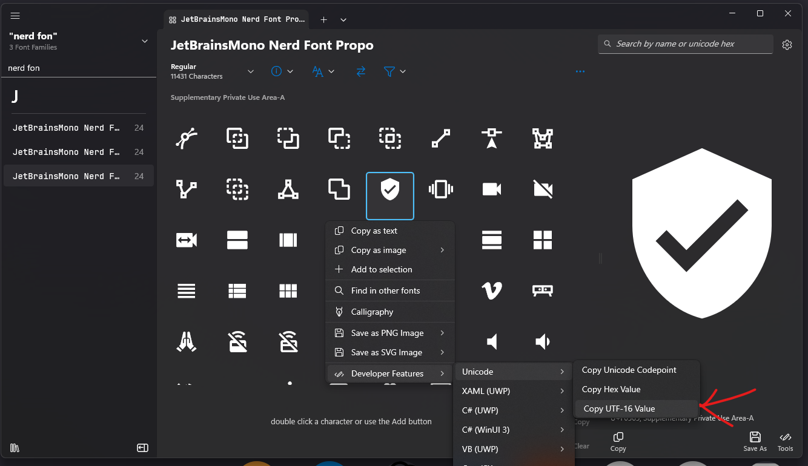

## Style file    

Styling is done using the CSS file format and with a file named `styles.css`.

Default directories for this file are `C:/Users/{username}/.config/yasb/` or the ENV variable `YASB_CONFIG_HOME` if set.

## Bar styling

The main YASB window can be styled with the following:
- `.yasb-bar`

## Widget Group Styling

Each widget group can be styled individually with the following:
- `.container-left`
- `.container-center`
- `.container-right`

## Generic Widget Style

A style with the `.widget` selector would affect all the widgets. In practice, you may prefer to use more specific `.*-widget` selectors.
Example: how to target the clock widget
```css
.clock-widget {
	border-top-left-radius: 18px;
	border-bottom-left-radius: 18px;
}
```

## Per-output styling

The main YASB windows carry a class tag with the name of the output this window is shown on.

```css
* { font-size: 13px;color: #cdd6f4; }
```

Example above will set the default font size and color of all elements unless overridden later on.


## Style Icons

Icons can be styled with the following:
- `.icon`

.icon class above will affect all icons inside the span tag in configuration file.
`label: "<span>\uf4bc</span> {virtual_mem_free}"`
You can specify different icon class in the configuration file as shown below.

```yaml
label: "<span class=\"icon-1"\">\uf4bc</span> {virtual_mem_free}"
```

> **Note**:
> To avoid some icons being cut off on the sides, it's recommended to use the proportional version of your Nerd Font (e.g. `JetBrainsMono Nerd Font Propo`),


## Style Text

Text can be styled with the following:
- `.label`

## Widget Container Styling

Each icon and text is wrapped in a container. This container can be styled with the following:
- `.widget-container`

Example how to target widget container

```css
.clock-widget .widget-container {
    background-color: #1e1e1e;
    border-radius: 10px;
}
.media-widget .widget-container {
    background-color: #1e1e1e;
    border-radius: 10px;
}
```

> **Note:**
> Keep in mind that YASB is written in Python using Qt framework and utilizes a custom CSS engine, so styling might be different from regular CSS3.

## Animations
Animations can be added to widgets using [transition](https://developer.mozilla.org/en-US/docs/Web/CSS/Reference/Properties/transition) property. It follows the same syntax as CSS transitions, but uses custom [animation engine](https://github.com/Video-Nomad/qt-css-engine) for PyQt6/PySide6.

Example of simple color transition on hover:
```css
.glazewm-workspaces .ws-btn {
    /* other properties... */
    background: transparent;
    transition: background 200ms ease-in-out;
}

.glazewm-workspaces .ws-btn:hover {
    /* This will be animated on mouse hover */
    background: gray;
}
```
Example of widget size and background transition on class change using `all` keyword and padding:
```css
.glazewm-workspaces .ws-btn {
    /* other properties... */
    padding: 1px 4px;
    transition: all 200ms ease-out;
}

.glazewm-workspaces .ws-btn.focused_populated,
.glazewm-workspaces .ws-btn.focused_empty {
     /* These two properties be animated on workspace change */
    pading: 1px 50px;
    background: gray;
}
```
Same can be done with `width` and `height` properties, or `min/max-width` and `min/max-height` if widget requires that (usually when nested widgets are involved, like GlazeWM with icons):
```css
.glazewm-workspaces .ws-btn {
    /* other properties */
    transition: all 200ms ease-out;
}

.glazewm-workspaces .ws-btn.focused_populated,
.glazewm-workspaces .ws-btn.focused_empty {
    /* Size will be animated from the default to the min/max values*/
    min-width: 50px;
    max-width: 50px;
}
```
Global opacity transition for all widget containers to add subtle fade effect on click:
```css
.widget-container {
    opacity: 1.0;
    transition: opacity 80ms;
}

.widget-container:clicked,
.widget-container:pressed {
    opacity: 0.5;
}
```
A `delay` can also be added to the transition as second time variable `transition: all 200ms 50ms ease-out`. Negative delay will result in animation starting instantly, but as if it was playing for the time of the delay.

Easing functions can be used as well, for example `ease-in-out` or `cubic-bezier(0.5, 0.2, 0.3, 0.9)`. Check this tool for [cubic-bezier](https://cubic-bezier.com) visualization.

[Steps](https://developer.mozilla.org/en-US/docs/Web/CSS/Reference/Values/easing-function/steps) function is also supported.

## Animation-supported pseudo-classes
- `:hover`
- `:focus`
- `:active` (Window focus pseudo. Not the same as `:active` in regular CSS)
- `:pressed` (Equivalent to `:active` in regular CSS)
- `:checked`
- `:clicked` (Special case. Will play the full animation on click)

## Additional supported CSS properties
- `opacity`
- `box-shadow`
- `text-shadow`
- `cursor` (not animatable)

## Animation limitations
Animations can't be added to sub-controls, for example `::item` or `::chunk` or others. Only regular QtCSS styling is available for those.

## Supported color functions (not animatable)
- `linear-gradient()`
- `radial-gradient()`
- `conic-gradient()`

## Follow OS Theme
YASB can follow the OS theme, if you have OS dark style YASB will add class `.dark` on the root element, if you want to have different light and dark themes you can use the following CSS to achieve this.

```css
.yasb-bar {
    /* background color for light style */
    background-color: #1e1e1e;
}
.dark.yasb-bar {
    /* background color for dark style */
    background-color: #1e1e1e;
}
.yasb-bar .label {
    /* text color for light style */
    color: #000000;
}
.dark.yasb-bar .label {
    /* text color for dark style */
    color: #ffffff;
}
.icon {
    color: #cdd6f4;
}

```

## Context Menu Styling
Context menus can be styled using the `.context-menu` class. This allows you to customize the appearance of menus within YASB. 
> **Note**:
> If you want to have different menu styles for each widget please refer to the Widget documentation for more information on how to achieve this.
> You can add dark class to context menu if you want to have a different style for dark mode as shown in the example below.

Example of context menu styling:
```css
/* Global context menu style */
.context-menu,
.context-menu .menu-checkbox {
    background-color: #202020;
    border: none;
    padding: 4px 0px;
    font-family: 'Segoe UI';
    font-size: 12px;
    color: #FFFFFF;
}
/* Dark style (optional) */
.dark.context-menu,
.dark.context-menu .menu-checkbox {
    background-color: #202020;
    color: #FFFFFF;
}
.context-menu::right-arrow {
    width: 8px;
    height: 8px;
    padding-right: 24px;
}
.context-menu::item,
.context-menu .menu-checkbox {
    background-color: transparent;
    padding: 6px 12px;
    margin: 2px 6px;
    border-radius: 6px;
    min-width: 100px;
}
.context-menu::item:selected,
.context-menu .menu-checkbox:hover {
    background-color: #3a3a3a;
    color: #FFFFFF;
}
.context-menu::separator {
    height: 1px;
    background-color: #404040;
    margin: 4px 8px;
}
.context-menu::item:disabled {
    color: #666666;
    background-color: transparent;
}
.context-menu .menu-checkbox .checkbox {
    border: none;
    padding: 8px 16px;
    font-size: 12px;
    margin: 0;
    color: #FFFFFF;
    font-family: 'Segoe UI'
}
.context-menu .submenu::item:disabled {
    margin: 0;
    padding-left: 16px;
}
.context-menu .menu-checkbox .checkbox:unchecked {
    color: #999
}
.context-menu .menu-checkbox .checkbox::indicator {
    width: 12px;
    height: 12px;
    margin-left: 0px;
    margin-right: 8px;
}
.context-menu .menu-checkbox .checkbox::indicator:unchecked {
    background: #444444;
    border-radius: 2px;
}
.context-menu .menu-checkbox .checkbox::indicator:checked {
    background: #007acc;
    border-radius: 2px;
}
.context-menu .menu-checkbox .checkbox:focus {
    outline: none;
}
.context-menu::item:checked {
    background-color: #0078d7;
    color: white;
}
```

## Tooltip Styling
Tooltips can be styled using the `.tooltip` class. This allows you to customize the appearance of tooltips within YASB.

Example of tooltip styling:
```css
.tooltip {
    background-color: #18191a;
    border: 1px solid #36383a;
    border-radius: 4px;
    color: #a6adc8;
    padding: 6px 12px;
    font-size: 13px;
    font-family: 'Segoe UI';
    font-weight: 600;
    margin-top: 4px;
}
/* Dark style (optional) */
.dark.tooltip {
    background-color: #18191a;
    border: 1px solid #36383a;
    color: #a6adc8;
}
```
## Icons
There is a nice app at [Character Map UWP](https://github.com/character-map-uwp/Character-Map-UWP) where you can select a font, click on icons, and copy the UTF-16 value. Alternatively, you can visit the Nerd Fonts site and do the same under the icons section.


