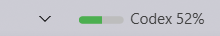
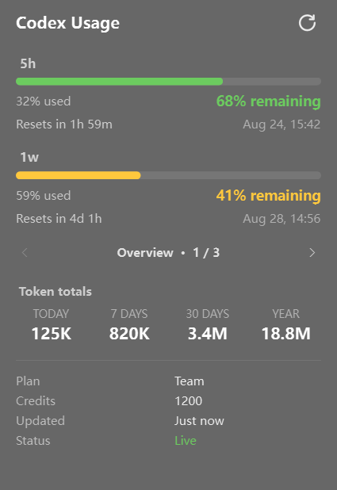

# Codex Usage Widget

Display the remaining percentage in the rate-limit windows reported by the Codex CLI. The
widget uses Codex's app-server protocol, so it never reads `~/.codex/auth.json`, copies access
tokens, or calls a private web endpoint. Fetching runs in a background thread and the last
normalized result is cached when Codex is temporarily unavailable.

## Requirements

- A recent Codex CLI available in `PATH` (or configured with `codex_path`).
- A ChatGPT-backed Codex login. Run `codex login` once if Codex is not already signed in.

The widget reuses the login managed by Codex itself. No additional login is needed on a machine
where the CLI already works. API-key-only authentication may not expose ChatGPT subscription
rate limits.



## Example Configuration

```yaml
codex_usage:
  type: "yasb.codex_usage.CodexUsageWidget"
  options:
    label: "Codex {primary_remaining}%"
    label_alt: "Codex {secondary_window} {secondary_remaining}%"
    update_interval: 60
    cache_ttl: 120
    timeout: 15
    show_token_usage: true
    stale_icon: "⚠"
    progress_bar:
      enabled: true
      progress_type: "linear_horizontal"
      size: 36
      thickness: 6
      radius: 3
      color: "#4caf50"
      background_color: "#3c3c3c"
      position: "left"
      animation: true
    callbacks:
      on_left: "toggle_menu"
      on_middle: "refresh"
      on_right: "toggle_label"
    menu:
      blur: true
      round_corners: true
      round_corners_type: "normal"
      border_color: "System"
      alignment: "right"
      direction: "down"
      offset_top: 6
      offset_left: 0
      show_overview: true
      show_models: true
      show_activity: true
      show_resets: true
      show_details: true
      refresh_icon: "\uE72C"
      previous_page_icon: "\uE76B"
      next_page_icon: "\uE76C"
```

## Options

| Option | Type | Default | Description |
|---|---|---|---|
| `label` | string | `Codex {primary_remaining}%` | Primary label template. |
| `label_alt` | string | `Codex {secondary_window} {secondary_remaining}%` | Alternate label shown by `toggle_label`. |
| `codex_path` | string | `codex` | Codex executable name or full path. |
| `update_interval` | integer | `60` | Refresh timer in seconds (30-3600). |
| `cache_ttl` | integer | `120` | Fresh-cache lifetime in seconds (0-3600). |
| `timeout` | number | `15` | app-server response timeout in seconds (1-60). |
| `tooltip` | boolean | `true` | Show remaining/used details on hover. |
| `show_token_usage` | boolean | `true` | Aggregate local session token metadata for the model chart and monthly heatmap. |
| `stale_icon` | string | `⚠` | Warning icon used by the `{stale}` placeholder. |
| `progress_bar` | dictionary | See example | Native bar indicator showing the active window's remaining percentage. |
| `callbacks` | dictionary | See example | Mouse actions. |
| `menu` | dictionary | See example | Popup position, appearance, section visibility, and Fluent navigation icons. |

The progress bar supports `circular`, `linear_horizontal`, and `linear_vertical`. `color` may be
a single color or a list of gradient colors. Right-click toggles the active label/window, and
the progress bar follows it.

## Details Popup

Left-click the widget to open a compact details window. The header and available rate-limit
windows stay visible. The lower, fixed-height area shows one page at a time:

- **Overview** - token totals for today, 7 days, 30 days, and one year, plus optional plan,
  credits, updated time, live/cached status, and cached errors;
- **Resets** - available account usage-limit resets and their expiration dates;
- **Models** - the 30-day model breakdown when model data is available;
- **Activity** - the monthly heatmap and its existing month navigation.

Use the Fluent previous/next buttons to switch pages. The active page is retained while the
persistent popup is reused. Navigation is hidden when only one page is available. Pages without
valid token data are omitted, and disabling every optional page leaves the fixed rate-limit
sections working normally.

The `menu` section switches control the lower area:

- `show_overview` shows token totals in the Overview page;
- `show_details` shows account and freshness details in the Overview page. If token totals are
  disabled but details are enabled, this page is labelled **Details**;
- `show_resets` shows the Resets page when the Codex CLI reports reset-credit metadata;
- `show_models` and `show_activity` control their respective pages.

`show_token_usage: false` remains the global switch for local token scanning. It hides token
totals, Models, and Activity without affecting rate limits or the optional account details.

Left-click again to close it. The middle-click `refresh` callback also refreshes without opening
the window. Accounts without a secondary limit simply omit that section.



## Refresh Feedback

Clicking the Fluent refresh button starts a rotating animation and displays `Refreshing…` in
the popup header. When the request finishes, the header briefly shows `Refresh successful` or
`Refresh failed`. The button is disabled while a refresh is running to prevent duplicate
requests. The middle-click callback still refreshes silently when the popup is closed.

Token statistics are calculated from `token_count` metadata in the current user's local Codex
session history. The scanner does not parse or retain prompt/response text, never opens
`auth.json`, and uploads nothing. Set `show_token_usage: false` to disable local history scanning
and hide these sections.

The monthly heatmap opens on the current month and can navigate across the current and previous
11 months. Months earlier than the first locally available Codex token record remain selectable
but are marked as unavailable rather than incorrectly displayed as zero usage.

## Placeholders

- `{primary_remaining}` / `{secondary_remaining}` - percentage remaining.
- `{primary_used}` / `{secondary_used}` - percentage already used.
- `{primary_window}` / `{secondary_window}` - duration reported by Codex, such as `5h`, `7d`, or `1w`.
- `{primary_reset}` / `{secondary_reset}` - time until reset.
- `{plan}` - account plan reported by Codex.
- `{credits}` - available credit balance, when present.
- `{stale}` - warning glyph when the last refresh failed and cached data is displayed.

Window names are deliberately derived from `windowDurationMins` instead of assuming that every
account has a 5-hour and weekly limit. Missing secondary limits render as `--` and are omitted
from the popup.

## Widget Style

```css
.codex-usage {}
.codex-usage .widget-container {}
.codex-usage .label {}
.codex-usage .progress-container {}

/* Popup menu */
.codex-usage-menu {}
.codex-usage-menu .header {}
.codex-usage-menu .header .text {}
.codex-usage-menu .header .refresh-status {}
.codex-usage-menu .header .refresh-status.busy {}
.codex-usage-menu .header .refresh-status.success {}
.codex-usage-menu .header .refresh-status.error {}
.codex-usage-menu .header .refresh {} /* Segoe Fluent Icons Refresh glyph */
.codex-usage-menu .header .refresh:hover {}
.codex-usage-menu .section {}
.codex-usage-menu .section .title {}
.codex-usage-menu .section .progress {}
.codex-usage-menu .section .progress .fill {}
.codex-usage-menu .section .progress.low .fill {}
.codex-usage-menu .section .progress.critical .fill {}
.codex-usage-menu .section .stats {}
.codex-usage-menu .section .used {}
.codex-usage-menu .section .remaining {}
.codex-usage-menu .section .remaining.good {}
.codex-usage-menu .section .remaining.low {}
.codex-usage-menu .section .remaining.critical {}
.codex-usage-menu .section .timing {}
.codex-usage-menu .section .reset {}
.codex-usage-menu .section .date {}
.codex-usage-menu .pager {}
.codex-usage-menu .page-nav {}
.codex-usage-menu .page-button {}
.codex-usage-menu .page-button:hover {}
.codex-usage-menu .page-button:disabled {}
.codex-usage-menu .page-indicator {}
.codex-usage-menu .page-stack {}
.codex-usage-menu .page {}
.codex-usage-menu .empty-state {}
.codex-usage-menu .overview-tokens {}
.codex-usage-menu .reset-credits-header {}
.codex-usage-menu .reset-credits-count {}
.codex-usage-menu .reset-credit-card {}
.codex-usage-menu .reset-credit-title {}
.codex-usage-menu .reset-credit-expiration {}
.codex-usage-menu .models {}
.codex-usage-menu .section-title {}
.codex-usage-menu .model-row {}
.codex-usage-menu .model-name {}
.codex-usage-menu .model-value {}
.codex-usage-menu .model-bar {}
.codex-usage-menu .model-bar .fill {}
.codex-usage-menu .period-name {}
.codex-usage-menu .period-value {}
.codex-usage-menu .activity {}
.codex-usage-menu .activity-title {}
.codex-usage-menu .month-label {}
.codex-usage-menu .month-nav {}
.codex-usage-menu .month-nav:hover {}
.codex-usage-menu .heatmap .weekday {}
.codex-usage-menu .history-note {}
.codex-usage-menu .heatmap .cell {}
.codex-usage-menu .heatmap .cell.level-1 {}
.codex-usage-menu .heatmap .cell.level-2 {}
.codex-usage-menu .heatmap .cell.level-3 {}
.codex-usage-menu .heatmap .cell.level-4 {}
.codex-usage-menu .heatmap .cell.unavailable {}
.codex-usage-menu .details {}
.codex-usage-menu .details .name {}
.codex-usage-menu .details .value {}
.codex-usage-menu .details .status.live {}
.codex-usage-menu .details .status.stale {}
.codex-usage-menu .details .error {}
```

`menu.refresh_icon`, `menu.previous_page_icon`, and `menu.next_page_icon` default to the matching
**Segoe Fluent Icons** glyphs and can be replaced without changing the Widget code. This font is
included with Windows 11; Windows 10 users may need to install it as described in the YASB
installation guide.

## Example Style

This complete default follows the Windows 11 styling used by the Claude Usage widget. It uses
readable Segoe UI sizes, compact Fluent controls, and thin separators instead of boxed cards.
Qt scales these logical pixel sizes with the active Windows display scale. The colors indicate
**remaining** capacity: green is healthy, amber is low, and red is critical.

```css
/* Bar */
.codex-usage .label {
    color: rgba(255, 255, 255, 0.9);
    font-size: 12px;
    font-weight: 500;
    padding-left: 5px;
}
.codex-usage .progress-container { margin-left: 3px; }

/* Popup menu */
.codex-usage-menu {
    background-color: rgba(32, 32, 32, 0.68);
    font-family: "Segoe UI";
    min-width: 340px;
}
.codex-usage-menu .header {
    padding: 9px 16px;
    border-bottom: 1px solid rgba(255, 255, 255, 0.1);
}
.codex-usage-menu .header .text {
    color: #ffffff;
    font-size: 16px;
    font-weight: 600;
}
.codex-usage-menu .header .refresh-status {
    color: rgba(255, 255, 255, 0.62);
    font-size: 12px;
    padding-right: 6px;
}
.codex-usage-menu .header .refresh-status.busy { color: rgba(255, 255, 255, 0.72); }
.codex-usage-menu .header .refresh-status.success { color: #6ccb5f; }
.codex-usage-menu .header .refresh-status.error { color: #ff6b6b; }
.codex-usage-menu .header .refresh {
    font-family: "Segoe Fluent Icons";
    color: rgba(255, 255, 255, 0.72);
    background-color: transparent;
    border: none;
    border-radius: 4px;
    font-size: 16px;
    min-width: 28px;
    max-width: 28px;
    min-height: 28px;
    max-height: 28px;
    padding: 0;
    margin: 0;
}
.codex-usage-menu .header .refresh:hover {
    color: #ffffff;
    background-color: rgba(255, 255, 255, 0.1);
}
.codex-usage-menu .section {
    padding: 8px 16px;
    border-bottom: 1px solid rgba(255, 255, 255, 0.1);
}
.codex-usage-menu .section .title {
    color: rgba(255, 255, 255, 0.7);
    font-size: 13px;
    font-weight: 600;
    padding-bottom: 6px;
}
.codex-usage-menu .section .progress {
    background-color: rgba(255, 255, 255, 0.1);
    border-radius: 4px;
    min-height: 8px;
    max-height: 8px;
}
.codex-usage-menu .section .progress .fill {
    background-color: #6ccb5f;
    border-radius: 4px;
}
.codex-usage-menu .section .progress.low .fill { background-color: #ffc83d; }
.codex-usage-menu .section .progress.critical .fill { background-color: #ff6b6b; }
.codex-usage-menu .section .stats { padding-top: 7px; }
.codex-usage-menu .section .used {
    color: rgba(255, 255, 255, 0.62);
    font-size: 12px;
}
.codex-usage-menu .section .remaining {
    color: #ffffff;
    font-size: 14px;
    font-weight: 600;
}
.codex-usage-menu .section .remaining.good { color: #6ccb5f; }
.codex-usage-menu .section .remaining.low { color: #ffc83d; }
.codex-usage-menu .section .remaining.critical { color: #ff6b6b; }
.codex-usage-menu .section .timing { padding-top: 6px; }
.codex-usage-menu .section .reset {
    color: rgba(255, 255, 255, 0.68);
    font-size: 12px;
}
.codex-usage-menu .section .date {
    color: rgba(255, 255, 255, 0.48);
    font-size: 12px;
}

/* Fixed-height page area */
.codex-usage-menu .pager { background-color: transparent; }
.codex-usage-menu .page-nav {
    padding: 5px 12px;
    border-bottom: 1px solid rgba(255, 255, 255, 0.08);
}
.codex-usage-menu .page-button,
.codex-usage-menu .month-nav {
    font-family: "Segoe Fluent Icons";
    color: rgba(255, 255, 255, 0.68);
    background-color: transparent;
    border: none;
    border-radius: 4px;
    font-size: 12px;
    min-width: 26px;
    max-width: 26px;
    min-height: 26px;
    max-height: 26px;
    padding: 0;
}
.codex-usage-menu .page-button:hover,
.codex-usage-menu .month-nav:hover {
    color: #ffffff;
    background-color: rgba(255, 255, 255, 0.08);
}
.codex-usage-menu .page-button:disabled,
.codex-usage-menu .month-nav:disabled {
    color: rgba(255, 255, 255, 0.22);
}
.codex-usage-menu .page-indicator {
    color: rgba(255, 255, 255, 0.82);
    font-size: 12px;
    font-weight: 600;
}
.codex-usage-menu .page-stack { background-color: transparent; }
.codex-usage-menu .page { padding: 12px 16px; }
.codex-usage-menu .empty-state {
    color: rgba(255, 255, 255, 0.55);
    font-size: 12px;
    padding: 18px 0;
}

/* Overview page */
.codex-usage-menu .overview-tokens { padding-bottom: 12px; }
.codex-usage-menu .section-title,
.codex-usage-menu .activity-title {
    color: rgba(255, 255, 255, 0.68);
    font-size: 12px;
    font-weight: 600;
}
.codex-usage-menu .section-title { padding-bottom: 8px; }
.codex-usage-menu .periods { padding-bottom: 4px; }
.codex-usage-menu .period-name {
    color: rgba(255, 255, 255, 0.5);
    font-size: 11px;
}
.codex-usage-menu .period-value {
    color: #ffffff;
    font-size: 16px;
    font-weight: 600;
}
.codex-usage-menu .details {
    padding-top: 12px;
    border-top: 1px solid rgba(255, 255, 255, 0.08);
}
.codex-usage-menu .details .name {
    color: rgba(255, 255, 255, 0.56);
    font-size: 12px;
}
.codex-usage-menu .details .value {
    color: rgba(255, 255, 255, 0.9);
    font-size: 12px;
}
.codex-usage-menu .details .status.live { color: #6ccb5f; }
.codex-usage-menu .details .status.stale { color: #ffc83d; }
.codex-usage-menu .details .error {
    color: #ff6b6b;
    font-size: 11px;
    max-height: 30px;
    padding-top: 5px;
}

/* Usage-limit reset credits page */
.codex-usage-menu .reset-credits-count {
    color: rgba(255, 255, 255, 0.55);
    font-size: 11px;
}
.codex-usage-menu .reset-credit-card {
    background-color: rgba(255, 255, 255, 0.06);
    border: 1px solid rgba(255, 255, 255, 0.09);
    border-radius: 5px;
    min-height: 44px;
    max-height: 44px;
    padding: 6px 10px;
}
.codex-usage-menu .reset-credit-title {
    color: rgba(255, 255, 255, 0.9);
    font-size: 12px;
    font-weight: 600;
}
.codex-usage-menu .reset-credit-expiration {
    color: rgba(255, 255, 255, 0.52);
    font-size: 11px;
}

/* Models page */
.codex-usage-menu .model-row {
    min-height: 27px;
    max-height: 27px;
}
.codex-usage-menu .model-name {
    color: rgba(255, 255, 255, 0.82);
    font-size: 12px;
    min-width: 96px;
    max-width: 96px;
}
.codex-usage-menu .model-value {
    color: rgba(255, 255, 255, 0.65);
    font-size: 12px;
    min-width: 52px;
    max-width: 52px;
}
.codex-usage-menu .model-bar {
    background-color: rgba(255, 255, 255, 0.11);
    border-radius: 3px;
    min-height: 7px;
    max-height: 7px;
}
.codex-usage-menu .model-bar .fill { background-color: #7d88e8; border-radius: 3px; }
.codex-usage-menu .row-2 .model-bar .fill { background-color: #b87ae7; }
.codex-usage-menu .row-3 .model-bar .fill { background-color: #e49ada; }
.codex-usage-menu .row-4 .model-bar .fill { background-color: #7eb5e8; }
.codex-usage-menu .row-5 .model-bar .fill { background-color: #7bc7a4; }

/* Activity page */
.codex-usage-menu .activity-header { padding-bottom: 7px; }
.codex-usage-menu .month-label {
    color: #ffffff;
    font-size: 12px;
    font-weight: 600;
    min-width: 106px;
    max-width: 106px;
}
.codex-usage-menu .heatmap .weekday {
    color: rgba(255, 255, 255, 0.5);
    font-size: 11px;
    min-width: 20px;
    max-width: 20px;
    padding-bottom: 2px;
}
.codex-usage-menu .history-note {
    color: rgba(255, 255, 255, 0.5);
    font-size: 11px;
    padding-top: 6px;
}
.codex-usage-menu .heatmap .cell {
    background-color: rgba(255, 255, 255, 0.08);
    border-radius: 3px;
    min-width: 20px;
    max-width: 20px;
    min-height: 20px;
    max-height: 20px;
}
.codex-usage-menu .heatmap .cell.level-1 { background-color: #244f2b; }
.codex-usage-menu .heatmap .cell.level-2 { background-color: #34713b; }
.codex-usage-menu .heatmap .cell.level-3 { background-color: #50a653; }
.codex-usage-menu .heatmap .cell.level-4 { background-color: #79d677; }
.codex-usage-menu .heatmap .cell.future,
.codex-usage-menu .heatmap .cell.outside { background-color: transparent; }
.codex-usage-menu .heatmap .cell.unavailable {
    background-color: transparent;
    border: 1px solid rgba(255, 255, 255, 0.08);
}
```

## Troubleshooting

- `Codex CLI was not found`: install Codex, add it to `PATH`, or set `codex_path` to its full path.
- `--` or a stale warning: run `codex` in a terminal and complete ChatGPT login, then middle-click the widget.
- Shared/public configuration: do not bundle a user's `.codex` directory or credentials. Each user must install and sign in to Codex under their own Windows account.
