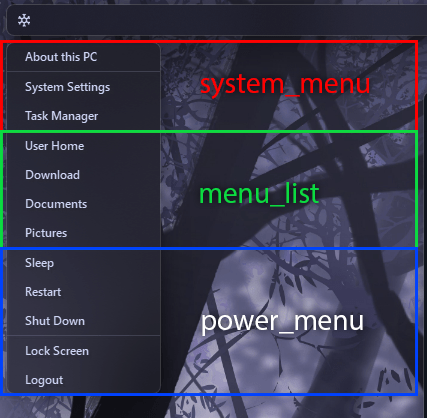

# Home Menu Widget Configuration

| Option          | Type    | Default                                                                 | Description                                                                 |
|-----------------|---------|-------------------------------------------------------------------------|-----------------------------------------------------------------------------|
| `label`         | string  | `"\udb81\udf17"`                                | Icon or text for button. |
| `menu_list`     | list    | `[]` | List of menu items. title and path |
| `system_menu`   | boolean | `true`                                                                 | Show system menu. |
| `power_menu`    | boolean | `true`                                                                 | Show power menu. |
| `blur`          | boolean | `true`                                                                 | Blur background. |
| `container_padding`  | dict | `{'top': 0, 'left': 0, 'bottom': 0, 'right': 0}`      | Explicitly set padding inside widget container. |

## Example Configuration

```yaml
home:
  type: "yasb.home.HomeWidget"
  options:
    label: "<span>\udb81\udf17</span>"
    menu_list:
    - { title: "User Home", path: "~" }
    - { title: "Download", path: "D:\\Downloads" }
    - { title: "Documents", path: "C:\\Users\\amn\\Documents" }
    - { title: "Pictures", path: "C:\\Users\\amn\\Pictures" }
    system_menu: true
    power_menu: true
    blur: true
    container_padding: 
      top: 0
      left: 0
      bottom: 0
      right: 0
```
 

## Description of Options

- **label**: Icon or text for button.
- **menu_list**: List of menu items. title and path. Use this list only for directories, do not use it for applications or files.
- **system_menu**: Show system menu. Enabling this option will show system menu items like settings, task manager and About this PC.
- **power_menu**: Show power menu. Enabling this option will show power menu items like shutdown, restart, sleep, lock and sign out.
- **blur**: Blur background. Enabling this option will blur the background and add default OS radius and border to the widget.

## Example Style
```css
.home-widget {
    padding: 0 4px 0 12px;
}
.home-widget .icon {
    color: #b4befe;
}
.home-widget .icon:hover {
    color: #cdd6f4;
}
.home-menu {
    background-color:rgba(17, 17, 27, 0.5); 
}
.home-menu .menu-item {
    padding: 6px 48px 7px 16px;
    font-size: 12px;
    font-family: 'Segoe UI', Tahoma, Geneva, Verdana, sans-serif;
    color: var(--text); 
    font-weight: 600;
}
.home-menu .menu-item:hover {
    background-color:rgba(128, 130, 158, 0.15);
    color: #fff;
}
.home-menu:separator {
    height: 1px;
    background-color:rgba(128, 130, 158, 0.3);
}
```

